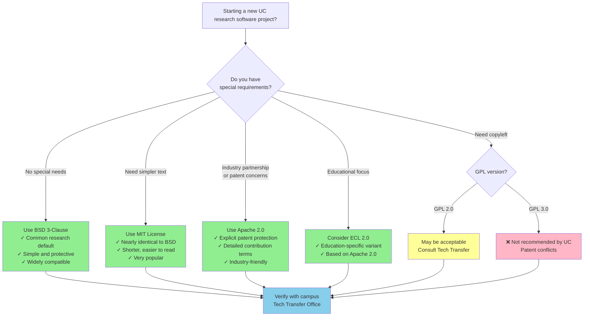

:::::::::::::::::::::::::::::::::::::: questions

* Why do you need a license for your code?
* How can an open-source license increase reuse and citation?
* What licenses does the UC system recommend?

::::::::::::::::::::::::::::::::::::::::::::::::

::::::::::::::::::::::::::::::::::::: objectives

* Explain why unlicensed software is not legally reusable
* Describe the main categories of open-source licenses
* Choose an appropriate license for a UC research project, using UC resources
* Add a license file to a GitHub repository
* **Supporting others:** decide when a licensing question is yours to answer and when to refer it to Tech Transfer / IP

::::::::::::::::::::::::::::::::::::::::::::::::

## Why licensing matters

Here is the counterintuitive fact this episode turns on: code posted publicly on GitHub with no license is not open. Copyright attaches automatically, so "no license" means "all rights reserved," and anyone who reuses that code is technically infringing. The visible repo is an invitation nobody can legally accept. A license file is one small text file, usually chosen from a short approved list, and it is the difference between "look but don't touch" and actually reusable.

Clear licensing tells others what they can and cannot do with your code, which is the minimum needed for open, reproducible research. The [UC OSPO License Guide][uc-license-guide] covers UC institutional requirements.

::::::::::::::::::::::::::::::::::::: callout

### An orphan work with a live author

Every librarian has met this object: the digitized photograph with no rights information, the orphan work nobody can clear. It sits in the collection, findable and useless, because no one can say yes to reuse. An unlicensed repo is the software version of an orphan work, except the author is right there and could fix it in five minutes.

Or put it in circulation terms: unlicensed public code is a volume you can see in the catalog but that the lending library will not release. Access without permission to use is not access in any way that matters for research.

::::::::::::::::::::::::::::::::::::::::::::::::

:::::::::::::::::::::::::::::::::::::::::::::::::::::::::::::::::::: instructor

**Why this episode matters to researchers:** licensing is where reuse and credit actually begin. An unlicensed repo cannot be legally built on, which means it will not accumulate the users, forks, and citations that make software count as a scholarly contribution. This is also the one episode with a hard referral boundary: you can explain categories and point to the campus default, but ownership questions go to Tech Transfer. Knowing where that line sits is itself the expertise.

::::::::::::::::::::::::::::::::::::::::::::::::::::::::::::::::::::::::::::::::

::::::::::::::::::::::::::::::: caution

### Institutional Context: Who Owns Your Software?

At most universities, software created using institutional resources is owned by the institution, not the individual researcher. Before releasing code under an open-source license, check with your **Technology Transfer or Intellectual Property office**. They will verify ownership, funding requirements, and any third-party restrictions.

**If you are at a UC campus:** software is typically owned by *The Regents of the University of California*. Your campus Tech Transfer office can help you select from the [UC-approved license list][uc-oss-chart]. *(UC-specific)*

**At other institutions:** check with your research computing, library, or legal office. Most will have a similar process and a list of preferred licenses.

::::::::::::::::::::::::::::::::

## Understanding license categories

Learners often fear a wall of legal text here, but the real decision is usually binary. Open-source licenses fall into two broad groups, and for most research code the whole choice takes less time than choosing a journal.

### Permissive licenses

**Examples: BSD, MIT, Apache 2.0**

These allow broad reuse with minimal restrictions.
Anyone can copy, modify, or redistribute the code.
They are common in research because they're simple and maximize flexibility.
Think of them as roughly a CC BY for code: "reuse this, just keep my name on it."

**BSD licenses are a common first choice at many research institutions** because they:

* originated at UC Berkeley
* are simple to understand
* protect both the institution and authors
* integrate well with most other licenses
* have minimal restrictions

### Copyleft licenses

**Example: GPL 2.0**

These require that derivative works also remain open-source.
This protects openness across the lifecycle of a project.
They add one condition to the permissive deal: "and anything you build from it must stay open too."

::::::::::::::::::::::::::::::: caution

### Note on GPL 3.0

The UC system does **not recommend GPL 3.0** for university-owned software due to patent provisions that may conflict with UC policies. If you need copyleft protection, consult your campus Tech Transfer office about GPL 2.0 or alternatives.

::::::::::::::::::::::::::::::::

## How to choose a license

:::::::::::::::::::::::::::::::::::::::::::::::::::: instructor

The decision guide below and the license references in this episode center UC policy and the UC OSPO guidance. For a non-UC workshop, swap in your own institution's license guidance and name the local office that answers ownership questions (usually a technology transfer or research office) in place of the UC pointers.

**Timebox the license discussion.** The teaching target is not license philosophy; it is recognizing no-license risk, choosing a low-risk default for the demo, and knowing when to refer ownership or policy questions to Tech Transfer or the local equivalent. If the room starts debating MIT vs BSD, name the campus default and move on.

::::::::::::::::::::::::::::::::::::::::::::::::::::::::::::::::::::

Five "low-risk" licenses are suitable for most research projects. Here's a decision guide:



### Quick reference

| Your need | Recommended license | SPDX identifier | Why |
|-----------|-------------------|-----------------|-----|
| Default / most projects | BSD 3-Clause | `BSD-3-Clause` | Common default at research institutions |
| Simplest possible | MIT | `MIT` | Minimal text, very popular |
| Industry collaboration | Apache 2.0 | `Apache-2.0` | Explicit patent terms |
| Educational focus | ECL 2.0 | `ECL-2.0` | Education-specific variant |

The **SPDX identifier** is the short, machine-readable code used by GitHub, Zenodo, and your `CITATION.cff` file to communicate your license automatically. When GitHub shows a license badge in the sidebar, it's reading the SPDX identifier.

**Always consult your institution's Tech Transfer or IP office before releasing software created with institutional resources.**

::::::::::::::::::::::::::::::::::::: spoiler

### What about data and documentation?

Software licenses (BSD, MIT, Apache) are written for *executable code*. If your repository also contains datasets, figures, or documentation, those files need a separate license.

The standard choice for research outputs is **Creative Commons Attribution 4.0 (CC BY 4.0)**, which allows broad reuse with attribution.

A common pattern:

- `/src` or your code files → `BSD-3-Clause` or `MIT`
- `/data` or `/docs` → `CC-BY-4.0`

You can note this split in your README and in `CITATION.cff` under the `license` field, which accepts a list:

```yaml
license:
  - BSD-3-Clause
  - CC-BY-4.0
```

Most research repositories don't need this, but if you're sharing a dataset alongside code, it's worth thinking through.

:::::::::::::::::::::::::::::::::::::::::::::::::

:::::::::::::::::::::::::::::: callout

### Resources

* [ChooseALicense.com][choosealicense] – Compare features across all common licenses.
* [SPDX License List](https://spdx.org/licenses/) – Authoritative registry of license identifiers used in CITATION.cff and package metadata.
* [UC OSPO License Guide][uc-license-guide] *(UC-specific)* – UC institutional requirements and templates.
* [UC OSS Chart and Companion Guide][uc-oss-chart] *(UC-specific)* – UC-approved "low-risk" license list.

:::::::::::::::::::::::::::::::::

::::::::::::::::::::::::::::::::::::: callout

### Supporting others

Licensing is the step where advising and *deciding* must stay separate. You can explain the categories, point to the campus default, and walk someone through adding a `LICENSE` file. You are not the office that determines who owns the code.

Refer rather than answer when:

- **Ownership is unclear** (institutional resources, grant funding, multiple institutions, industry partners). This goes to Tech Transfer / IP, not the service desk.
- The repo pulls in **third-party code or data** with its own license terms that might conflict.
- Someone wants to **relicense or remove a license** on code that already has contributors.

What you *can* own confidently: knowing your campus default (BSD-3-Clause at UC), knowing the approved-license list exists, and making sure the ownership question gets asked before code goes public. The most useful thing you do here is often a warm handoff, not a recommendation.

::::::::::::::::::::::::::::::::::::::::::::::::

::::::::::::::::::::::::::::::::::::: instructor

### Expected UI state: the license template chooser

When the filename is `LICENSE`, GitHub should offer a license template chooser ("Choose a license template"). If learners do not see it, check the filename, that they are creating the file in the repository root, and a browser refresh before troubleshooting anything more complex.

::::::::::::::::::::::::::::::::::::::::::::::::

::::::::::::::::::::::::::::: challenge

## Challenge: Add a BSD License to Your Repository

We will add the BSD 3-Clause license to your demo repository:

1. Navigate to your repository on GitHub.
2. Click **Add file** → **Create new file**.
3. Name it exactly `LICENSE` (no file extension).
4. Click **Choose a license template** and select **BSD 3-Clause License**.
5. Update the copyright holder to reflect who owns the software. At UC campuses this is `The Regents of the University of California`; at other institutions check with your Tech Transfer office. *(If this is a personal project, use your own name.)*
6. Update the year to 2026.
7. Commit the file to your `main` branch.

{alt="GitHub's create-new-file page in the software-demo repository, with the filename field set to LICENSE and the 'Choose a license template' button both highlighted."}

**Verify:** Does your repository now display the "BSD-3-Clause" license badge in the sidebar?

:::::::::::::::::::::::: solution

GitHub automatically detects the `LICENSE` file and displays it in the sidebar. Your file should look like this:

```
BSD 3-Clause License

Copyright (c) 2026, The Regents of the University of California
All rights reserved.
```

If the badge doesn't appear, ensure the file is in the root directory and named exactly `LICENSE`.

:::::::::::::::::::::::::::::::::
::::::::::::::::::::::::::::::::

::::::::::::::::::::::::::::::::::::: callout

### Check your work

Compare your fork against the [`after-license` reference branch][branch-after-license] on the [demo repository][demo-repo]. It shows the target state after this episode: a `LICENSE` file in the root and the BSD-3-Clause badge in the sidebar.

::::::::::::::::::::::::::::::::::::::::::::::::

## Communicating your license

After adding a LICENSE file, reference it in your README so users immediately understand usage terms.

Add this section near the top of your README:
```markdown
## License

This project is licensed under the BSD 3-Clause License - see the [LICENSE](LICENSE) file for details.
```

**Why this matters:** Users reading your README on platforms other than GitHub (Zenodo, email, exported PDFs) will see your license terms even without GitHub's automatic detection.

::::::::::::::::::::::::::::: challenge

## Exercise: License Scenarios

Which license would you recommend for each UC research scenario?

**Scenario 1:** A Python package for ecological data analysis. You want maximum adoption across academia and industry.

**Scenario 2:** A data visualization tool developed with a biotech partner who may commercialize derivatives.

**Scenario 3:** A simple utility script you're sharing with collaborators.

:::::::::::::::::::::::: solution

**Scenario 1:** BSD 3-Clause (UC's default recommendation, maximum flexibility and adoption)

**Scenario 2:** Apache 2.0 (explicit patent protection important for industry partnerships)

**Scenario 3:** Either BSD 3-Clause or MIT (both work well for simple sharing; BSD preferred by UC)

In all cases, verify with your campus Tech Transfer office before releasing.

:::::::::::::::::::::::::::::::::
::::::::::::::::::::::::::::::::

## Summary

Licensing is foundational to making research software usable, citable, and shareable.
In this episode, you added a BSD license to a repository following UC recommendations.

::::::::::::::: keypoints

* Without a license, software is legally restricted and not reusable
* BSD 3-Clause is a common default at research institutions; MIT and Apache 2.0 are strong alternatives
* Permissive licenses (BSD, MIT, Apache 2.0) maximize flexibility and adoption
* Always consult your institution's Tech Transfer or IP office before releasing institutionally-owned software
* GitHub makes adding standard licenses straightforward

:::::::::::::::
