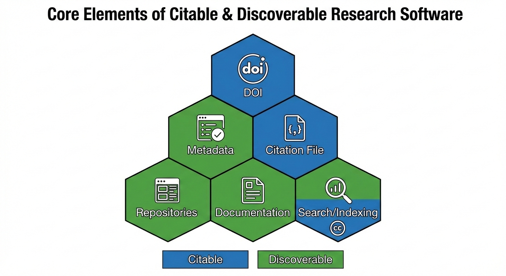

{
alt='Hex-style icon representing research software, metadata, and citation'
style='padding: 2%'}

## The Problem: The "Works on My Machine" Trap

You send your code to a colleague and they report:

- "It crashes on line 1" 😞
- "I can't install the dependencies"
- "Which Python version did you use?"

```output
$ python src/analysis.py

Traceback (most recent call last):
  File "analysis.py", line 1, in <module>
    import numpy as np
ModuleNotFoundError: No module named 'numpy'
```

**This is where most research software lives. Fragile.**

### The Bus Factor Problem

Code works perfectly on ONE laptop. If it disappears, the science is gone.

## The Solution: FAIR4RS Principles

This lesson teaches practical steps to make your software **Findable, Accessible, Interoperable, and Reusable (FAIR)**. You'll learn high-impact, low-effort practices such as adding a CITATION.cff file, choosing an open-source license, documenting dependencies with pixi, and improving metadata for discoverability.

The lesson is intended for researchers who write code as part of their work but do not necessarily identify as software developers. Graduate students, research staff, and librarians who support research software will also find the material useful.

Learners will make small, meaningful improvements to an existing GitHub repository and see how these practices increase attribution, transparency, and research impact.

## Learning Objectives

After completing this lesson, learners will be able to:

- explain why research software should be cited and attributed.
- add and validate a CITATION.cff file in a GitHub repository.
- choose and apply an appropriate open-source license.
- improve software discoverability through documentation and metadata.
- understand how packaging tools like pixi can support usability and reproducibility.
- describe how these practices support FAIR principles for research software.
- identify small, high-value improvements that increase the visibility and impact of their software.

:::::::::::::::::::::::::::::::::::::::::: prereq

## Prerequisites

Before beginning this lesson, learners should be able to:

- navigate GitHub in a web browser (view files, edit files, open issues).
- understand basic Git concepts such as commits and repositories.
- edit plain-text files in any text editor.

You don't need any prior experience with software packaging, metadata standards, or licensing.

::::::::::::::::::::::::::::::::::::::::::::::::::

::::::::::::::::::::::::::::::::::::::::: callout
## Acknowledgment

This lesson is derived from the *Building Better Research Software* curriculum, created by Sarah Gibson, Aman Goel, Toby Hodges, Sarah Jaffa, Kamilla Kopec-Harding, Aleksandra Nenadic, Colin Sauze, and Sarah Stevens.

A full citation and DOI for the original lesson appear on this lesson's [Cite This Lesson](../index.html#citing) page, automatically generated from the repository's CITATION.cff file.

::::::::::::::::::::::::::::::::::::::::::::::::::
