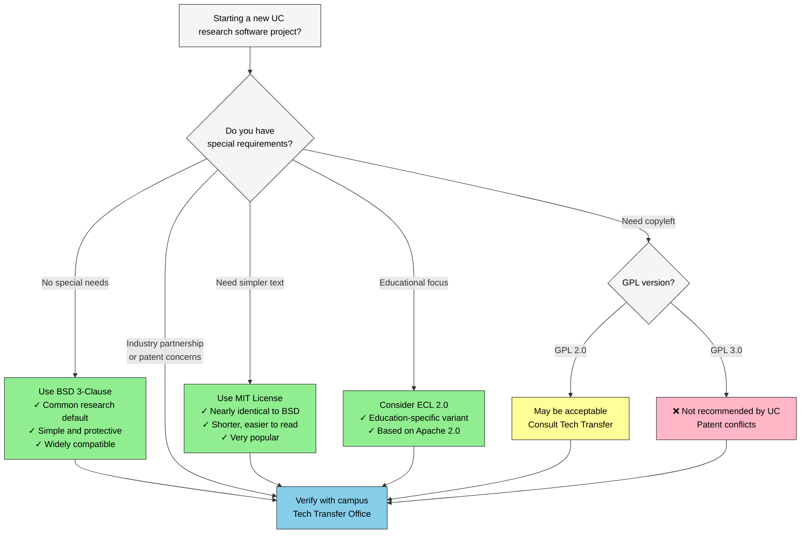

:::::::::::::::::::::::::::::::::::::: questions

* Why do you need a license for your code?
* How can an open-source license increase reuse and citation?
* What licenses does the UC system recommend?

::::::::::::::::::::::::::::::::::::::::::::::::

::::::::::::::::::::::::::::::::::::: objectives

* Explain why unlicensed software is not legally reusable
* Describe the main categories of open-source licenses
* Choose an appropriate license for a UC research project or using UC resources
* Add a license file to a GitHub repository
* **Supporting others:** decide when a licensing question is yours to answer and when to refer it to Tech Transfer / IP

::::::::::::::::::::::::::::::::::::::::::::::::

## Disclaimer
This workshop is not meant to provide legal advice or replace consulting with an attorney. The information contained herein is provided for informational purposes only, and should not be construed as legal advice on any subject matter. The contents of this episode contains general information and may not reflect current legal developments or address your situation. If you require legal advice, please consult with your attorney. No attorney-client relationship is created between you and the authors/presenter of this episode or University of California.

## Why licensing matters

Here is the counterintuitive fact this episode turns on: code posted publicly on GitHub with no license is not open. Copyright attaches automatically, so "no license" means "all rights reserved," and anyone who reuses that code is technically infringing. The visible repo is an invitation nobody can legally accept. A license file is one small text file, usually chosen from a short approved list, and it is the difference between "look but don't touch" and actually reusable.

Clear licensing tells others what they can and cannot do with your code, which is the minimum needed for open, reproducible research.

::::::::::::::::::::::::::::::::::::: callout

### An unclaimed work with a live author

Every librarian has met this object: the digitized photograph with no rights information, the orphan work nobody can clear. It sits in the collection, findable and useless, because no one can say yes to reuse. An unlicensed repo is the software version of an orphan work, except the author is right there and could fix it in five minutes.

Or put it in circulation terms: unlicensed public code is a volume you can see in the catalog but that the lending library will not release. Access without permission to use is not access in any way that matters for research.

::::::::::::::::::::::::::::::::::::::::::::::::

:::::::::::::::::::::::::::::::::::::::::::::::::::::::::::::::::::: instructor

**Why this episode matters to researchers:** licensing is where reuse and credit actually begin. An unlicensed repo cannot be legally built on, which means it will not accumulate the users, forks, and citations that make software count as a scholarly contribution. This is also the one episode with a hard referral boundary: you can explain categories and point to the campus default, but ownership questions go to Tech Transfer. Knowing where that line sits is itself the expertise.

::::::::::::::::::::::::::::::::::::::::::::::::::::::::::::::::::::::::::::::::

::::::::::::::::::::::::::::::: caution

### Institutional Context: Who Owns Your Software?

At most universities, software created using institutional resources or created as part of research is owned by the institution, not the individual researcher. Before releasing code under an open-source license, check with your **Technology Transfer or Intellectual Property office**. They will verify ownership, funding requirements, and any third-party restrictions.

**If you are at a UC campus:** software is typically owned by *The Regents of the University of California*. The [UC Copyright policy](https://copyright.universityofcalifornia.edu) governs copyright ownership. Prior to release, contact your campus Tech Transfer office to verify ownership, funding requirements, and any third-party restrictions.

Once the TTO has cleared your code for release, the TTO or the UC OSPO Network can help you choose a license. UC's risk chart, below, shows how UC rates the common ones. *(UC-specific)*

The [UC OSPO License Guide][uc-license-guide] covers UC institutional requirements.

**At other institutions:** check with your research computing, library, or legal office. Most will have a similar process and a list of preferred licenses.

::::::::::::::::::::::::::::::::

UC's [open source software risk chart][uc-oss-chart-pdf] rates BSD, the license used in this exercise, low in every scenario it lists. A low rating does not approve the release of a particular project. Before licensing Regents-owned software, follow your campus's process for approval by the appropriate delegated authority. *(UC-specific)*

Full chart (PDF): <https://security.ucop.edu/files/documents/resources/oss-chart.pdf>

::::::::::::::::::::::::::::::::::::: spoiler

### UC license risk chart: a short guide

UC's chart gives each license one of three ratings: **low**, **moderate**, or **high risk**. The rating is about how likely that license is to conflict with UC policy.

Table: UC's risk ratings for common open source licenses, simplified

| UC rating | Licenses | In plain terms |
|---|---|---|
| Low risk | BSD, MIT, Apache 1.x, GPL 2.x and LGPL 2.x (not "any later version"), ECL 2.0 | Generally fine to use and to share, inside or outside UC |
| Moderate risk | Apache 2.0, Eclipse (EPL) 1.0/2.0, MPL 2.0 | Fine to use inside UC with a notice. Sharing modified code outside UC needs a closer look. |
| High risk | GPL 3.0, LGPL 3.0, AGPL 3.0 | Fine to use inside UC with a notice. Sharing outside UC is rarely approved. |
| Not rated | Any other license | Ask your campus licensing office |

A rating isn't an approval. It tells you how quick the approval conversation is likely to be, not whether a license suits your project. For new code created at UC, start with your campus licensing office. A few licenses have exceptions for specific situations; see the [full chart][uc-oss-chart-pdf] and its [companion guide][uc-oss-companion] for those.

::::::::::::::::::::::::::::::::::::::::::::::::

::::::::::::::::::::::::::::::::::::: instructor

Say out loud that the risk chart is UC guidance. Learners from other institutions should ask their own tech transfer or research office, which will have its own process. If someone asks "BSD is low risk, so can I release now?", the answer is no: a low rating makes the approval conversation short, it doesn't replace it.

::::::::::::::::::::::::::::::::::::::::::::::::

::::::::::::::::::::::::::::: challenge

## Challenge: True or False

* [Myth or Fact] If you post your code publicly on the internet, it automatically becomes Open Source. 
* [Myth or Fact] An open source license is essentially a legal “permission slip” from the creator. 
* [Myth or Fact] An open source license means I am giving away my ownership of the code.

:::::::::::::::::::::::: solution
* [Myth or Fact] If you post your code publicly on the internet, it automatically becomes Open Source.   FALSE/MYTH
* [Myth or Fact] An open source license is essentially a legal “permission slip” from the creator.  TRUE/FACT
* [Myth or Fact] An open source license means I am giving away my ownership of the code. FALSE/MYTH

:::::::::::::::::::::::::::::::::

::::::::::::::::::::::::::::::::

## Understanding license categories

Open-source licenses fall into two broad groups; within those groups, there is some gradation.  Once you understand them, choosing a license becomes easier.

The two categories are:
* Permissive licenses
* Copyleft licenses

### Permissive licenses

* Easy to comply with
* These allow broad reuse with minimal restrictions. 
* Anyone can freely copy, modify, or redistribute the code. 
* They are common in research because they're simple and maximize flexibility. 
* Think of them as roughly a CC BY for code: "reuse this, just keep my name on it."

Examples:  **BSD and MIT**

Note:  There are different flavors of BSD: 

* 2-Clause and 3-Clause 
* 3-Clause includes a clause that explicitly states no endorsement or use of the licensor’s name. It is recommended by UC

**BSD licenses are a common first choice at many research institutions** because they:

* originated at UC Berkeley
* are simple to understand
* protect both the institution and authors
* integrate well with most other licenses
* have minimal restrictions

::::::::::::::::::::::::::::::: caution

### Special case: Apache and BSD + Patent

Both are considered Permissive licenses; BUT they contain explicit patent grants.

The UC and many corporations are wary about patent grants because these patent grants can inadvertently reach into their patent portfolio and cover a patent from another campus or lab/research team.

For this reason, releasing code under Apache or BSD + Patent is disfavored.

:::::::::::::::::::::::::::::::

### Copyleft licenses

Copyleft licenses are also known as viral or reciprocal licenses. The UC OSS Chart uses the term hereditary.

These require that derivative works also remain open source. This is accomplished by requiring that derivative works must be licensed under the same copyleft license as the original work.

This protects openness across the lifecycle of a project.

#### What counts as a derivative work?

What counts as a derivative work can be ambiguous, and it is a legal question.

* Strong copyleft licenses (like GPL and AGPL) define derivative works broadly, so linking can create a derivative work.
* Weak copyleft licenses (like LGPL, MPL, EPL) usually either:
  * provide an exception that allows certain combinations of your work and the original work without triggering the copyleft provision; or
  * limit derivative works to modifications of files in the original work.

::::::::::::::::::::::::::::::: caution

### Version 3 of GPL, AGPL, LGPL 

The UC system does **not recommend version 3.0 of GPL, AGPL, and LGPL** for university-owned software due to patent provisions that may conflict with UC policies. If you need copyleft protection, consult your campus Tech Transfer office about GPL 2.0 or alternatives.

::::::::::::::::::::::::::::::::

## How to choose a license

:::::::::::::::::::::::::::::::::::::::::::::::::::: instructor

The decision guide below and the license references in this episode center UC policy and the UC OSPO guidance. For a non-UC workshop, swap in your own institution's license guidance and name the local office that answers ownership questions (usually a technology transfer or research office) in place of the UC pointers.

**Timebox the license discussion.** The teaching target is not license philosophy; it is recognizing no-license risk, choosing a low-risk default for the demo, and knowing when to refer ownership or policy questions to Tech Transfer or the local equivalent. If the room starts debating MIT vs BSD, name the campus default and move on.

::::::::::::::::::::::::::::::::::::::::::::::::::::::::::::::::::::

Five "low-risk" licenses are suitable for most research projects. Here's a decision guide:



<style>
/* The site's global `p { color: ... }` rule overrides Mermaid's per-node
   text color in both themes; force the label paragraphs to inherit the
   color Mermaid already set on their parent .nodeLabel span instead. */
.mermaid .nodeLabel p { color: inherit !important; }
</style>

### Quick reference

| Your need | Recommended license | SPDX identifier | Why |
|-----------|-------------------|-----------------|-----|
| Default / most projects | BSD 3-Clause | `BSD-3-Clause` | Common default at research institutions |
| Simplest possible | MIT | `MIT` | Minimal text, very popular |
| Educational focus | ECL 2.0 | `ECL-2.0` | Education-specific variant of Apache 2.0 |

The **SPDX identifier** is the short, machine-readable code used by GitHub, Zenodo, and your `CITATION.cff` file to communicate your license automatically. When GitHub shows a license badge in the sidebar, it's reading the SPDX identifier.

**Always consult your institution's Tech Transfer or IP office before releasing software created with institutional resources, as part of your research, with grant funding, across multiple institutions, or with an industry partner.**

::::::::::::::::::::::::::::::::::::: spoiler

### What about data and documentation?

Software licenses (BSD, MIT, Apache) are written for *executable code*. If your repository also contains datasets, figures, or documentation, those files need a separate license.

The standard choice for research outputs is **Creative Commons Attribution 4.0 (CC BY 4.0)**, which allows broad reuse with attribution.

A common pattern:

- `/src` or your code files → `BSD-3-Clause` or `MIT`
- `/data` or `/docs` → `CC-BY-4.0`

You can note this split in your README and in `CITATION.cff` under the `license` field, which accepts a list:

```yaml
license:
  - BSD-3-Clause
  - CC-BY-4.0
```

Most research repositories don't need this, but if you're sharing a dataset alongside code, it's worth thinking through.

:::::::::::::::::::::::::::::::::::::::::::::::::

:::::::::::::::::::::::::::::: callout

### Resources

* [ChooseALicense.com][choosealicense] – Compare features across all common licenses.
* [SPDX License List](https://spdx.org/licenses/) – Authoritative registry of license identifiers used in CITATION.cff and package metadata.
* [UC OSPO License Guide][uc-license-guide] *(UC-specific)* – UC institutional requirements and templates.
* [UC OSS Chart and Companion Guide][uc-oss-chart] *(UC-specific)* – UC's license risk ratings for common open source licenses. <https://security.ucop.edu/files/documents/resources/oss-chart.pdf>

:::::::::::::::::::::::::::::::::

::::::::::::::::::::::::::::::::::::: callout

### Supporting others

Licensing is the step where advising and *deciding* must stay separate. You can explain the categories, point to the campus default, and walk someone through adding a `LICENSE` file. You are not the office that determines who owns the code.

Refer rather than answer when:

- **Ownership is unclear** (institutional resources, grant funding, multiple institutions, industry partners). This goes to Tech Transfer / IP, not the service desk.
- The repo pulls in **third-party code or data** with its own license terms that might conflict. This is VERY IMPORTANT. Package managers, Docker containers, and build tools can add libraries or other code to your code. You need to ensure that this additional code does not have a conflicting license. No copyleft in permissively licensed product. No unlicensed code. No Apache in version 2 of GPL variants.
- Someone wants to **relicense or remove a license** on code that already has contributors.

What you *can* own confidently: knowing your campus default (BSD-3-Clause at UC), knowing UC's license risk chart exists, and making sure the ownership question gets asked before code goes public. The most useful thing you do here is often a warm handoff, not a recommendation.

::::::::::::::::::::::::::::::::::::::::::::::::

::::::::::::::::::::::::::::::::::::: instructor

### Expected UI state: the license template chooser

When the filename is `LICENSE`, GitHub should offer a license template chooser ("Choose a license template"). If learners do not see it, check the filename, that they are creating the file in the repository root, and a browser refresh before troubleshooting anything more complex.

::::::::::::::::::::::::::::::::::::::::::::::::

::::::::::::::::::::::::::::: challenge

## Challenge: Add a BSD License to Your Repository

We will add the BSD 3-Clause license to your demo repository:

1. Navigate to your repository on GitHub.
2. Click **Add file** → **Create new file**.
3. Name it exactly `LICENSE` (no file extension).
4. Click **Choose a license template** and select **BSD 3-Clause License**.
5. Update the copyright holder to reflect who owns the software. At UC campuses this is `The Regents of the University of California`; at other institutions check with your Tech Transfer office. *(If this is a personal project, use your own name.)*
6. Update the year to 2026.
7. Commit the file to your `main` branch.

{alt="GitHub's create-new-file page in the software-demo repository, with the filename field set to LICENSE and the 'Choose a license template' button both highlighted."}

**Verify:** Does your repository now display the "BSD-3-Clause" license badge in the sidebar?

:::::::::::::::::::::::: solution

GitHub automatically detects the `LICENSE` file and displays it in the sidebar. Your file should look like this:

```
BSD 3-Clause License

Copyright (c) 2026, The Regents of the University of California
All rights reserved.
```

If the badge doesn't appear, ensure the file is in the root directory and named exactly `LICENSE`.

:::::::::::::::::::::::::::::::::

::::::::::::::::::::::::::::::::

::::::::::::::::::::::::::::::::::::: callout

### Check your work

Compare your fork against the [`02-add-license` reference branch][branch-license] on the [demo repository][demo-repo]. It shows the target state after this episode: a `LICENSE` file in the root and the BSD-3-Clause badge in the sidebar.

::::::::::::::::::::::::::::::::::::::::::::::::

## Communicating your license

After adding a LICENSE file, reference it in your README so users immediately understand usage terms.

Add this section near the top of your README:
```markdown
## License

This project is licensed under the BSD 3-Clause License - see the [LICENSE](LICENSE) file for details.
```

**Why this matters:** Users reading your README on platforms other than GitHub (Zenodo, email, exported PDFs) will see your license terms even without GitHub's automatic detection.

::::::::::::::::::::::::::::: challenge

## Exercise: License Scenarios

Which license would you recommend for each UC research scenario?

**Scenario 1:** A Python package for ecological data analysis. You want maximum adoption across academia and industry.

**Scenario 2:** A data visualization tool that you only want other researchers to use.

**Scenario 3:** A simple utility script you're sharing with collaborators.

:::::::::::::::::::::::: solution

**Scenario 1:** BSD 3-Clause (UC's default recommendation, maximum flexibility and adoption)

**Scenario 2:** Talk to TTO or OSPO Network to find a public source license with restrictions permitting only non-commercial/educational/research use.

**Scenario 3:** Either BSD 3-Clause or MIT (both work well for simple sharing; BSD preferred by UC)

In all cases, verify with your campus Tech Transfer office before releasing.

:::::::::::::::::::::::::::::::::

::::::::::::::::::::::::::::::::

## Summary

Licensing is foundational to making research software usable, citable, and shareable.
In this episode, you added a BSD license to a repository following UC recommendations.

::::::::::::::: keypoints

* Without a license, software is legally restricted and not reusable
* BSD 3-Clause is a common default at research institutions; MIT is a strong alternative
* Permissive licenses (BSD, MIT) maximize flexibility and adoption
* Always consult your institution's Tech Transfer or IP office before releasing institutionally-owned software
* GitHub makes adding standard licenses straightforward

:::::::::::::::
